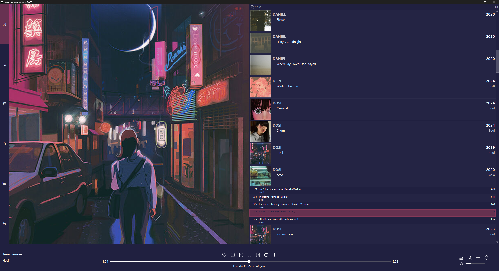

A crappy responsive [Spider Monkey Panel](https://github.com/TheQwertiest/foo_spider_monkey_panel) based foobar2000 theme (CUI).  
This theme is supported in foobar2000 32-bit & 64-bit.

# Preview
  
Responds to window size & seamlessly snaps to win11 snap layouts. Manual resizing of the window however is a bit more taxing.  

# Modularity
* All panels can be used individually for other themes
* The main panel is the blueprint for the layout & controls panel placement within the main JSplitter
    * Can be used to easily make other themes responsive with some modding
    * Relies on (custom) panel title to place panels. These are accessible inside the CUI layout editor
    * Panels can be swapped out if the same title is kept or if the script is modified
    * Refer to [Useful to know](#useful-to-know) for further info on main panel
* Panels within the tab script are not hardcoded, they can be edited.

# Install
## Fonts
Standard on win11: [Segoe Fluent Icons](https://learn.microsoft.com/en-us/windows/apps/design/downloads/#fonts)  
Optional (For Biography): [Fontawesome](https://github.com/FortAwesome/Font-Awesome/blob/4.x/fonts/fontawesome-webfont.ttf)

## Components
[Columns UI](https://www.foobar2000.org/components/view/foo_ui_columns)  
[OpenLyrics](https://www.foobar2000.org/components/view/foo_openlyrics)  
[JSplitter](https://hydrogenaudio.org/index.php/topic,126743.msg1063721.html#msg1063721) (4.0.4)  

Optional:  
[Waveform minibar (mod)](https://www.foobar2000.org/components/view/foo_wave_minibar_mod)  
[Playback Statistics](https://www.foobar2000.org/components/view/foo_playcount) (alternatively foo_lastfm_playcount_sync)  
[Scrobble](https://www.foobar2000.org/components/view/foo_scrobble) (if last.fm sync is desired)

## Packages
[Biography](https://github.com/Wil-B/Biography)  

Optional:  
[Library Tree](https://github.com/Wil-B/Library-Tree)  
[Not-A-Waveform-Seekbar-SMP](https://github.com/regorxxx/Not-A-Waveform-Seekbar-SMP) (3.0.0)

# Installation Instructions
1.  Install required components if not yet installed: Preferences -> Components -> Install -> Restart
2.  Set display to CUI if not yet set: Preferences -> Display -> User Interface Module -> Columns UI -> restart
3.  Import required packages: place a Jsplitter in fb2k -> configure -> package -> package manager -> import -> select package zip file
4.  Place the files in their respective directories. "foobar2000-v2" is typically located at:
    - C:\Users\yourUserName\AppData\Roaming\foobar2000-v2\user-components-x64\foo_uie_jsplitter\samples
5.  Copy each file into their respective directory (samples subfolders):
    - samples\complete
    - samples\js-smooth
    - samples\poobar  
    - Alternatively store them elsewhere, this requires adjusting the scripts.
6.  Import fcl layout: Preferences -> Columns UI -> Import configuration -> poobar_filter
    - _library if LibTree is desired else _filter
7. Manually add waveform of choice if desired: Preferences -> Layout -> JSplitter titled 'Fluent Control Panel' -> right click -> insert panel
    - pick either Waveform minibar (mod) or a JSplitter with the Not-A-Waveform-Seekbar-SMP package
    - If a JSplitter is chosen set custom panel title to 'Waveform minibar (mod)' so the control panel can detect it.
    - Note: Not-A-Waveform-Seekbar-SMP can be more taxing than Waveform minibar (mod). Configure it to use the least resources.

# Useful to know
## General
* Tabs support vertical & horizontal orientation.
* Playcount toggle in PL view: foo_playcount or lastfm_playcount. Both store a local DB.
* The font used for OpenLyrics in this theme is "UD Digi Kyokasho NP-R" size 12
    * To change font: Preferences -> Tools -> OpenLyrics -> Display -> check Custom font -> select font
* When using the like/heart buttons make sure both the fluent control panel (seekbar section) and the PL are set to the same mode.
* queue button instructions:
    * left click: add
    * right click: remove
    * middle click: clear
    * double click then right click (reason for combo is it's bugged/incomplete): add randomly (requires selecting multiple tracks)

## Main Panel
The main panel currently has 6 panels it looks out for titled:
* Fluent Control Panel
* Playlist View
* Tab Stack
* Smooth Browser
* Essentials Fallback Stack  

If the title of any of these are changed the main panel can not fetch the panel.

# Issues
1. If there is a pop-up about the rating each time the Fluent Control Panel script is loaded: Right click the rating stars & set mode to foo_playcount. This will eliminate the popup.
2. If monitor resolution is changed while foobar is open restart to refresh.
3. If ever locked out of access to preferences button: ctrl + p

---
Credits to the original authors of any modified scripts. Names can be found in their respective scripts.
