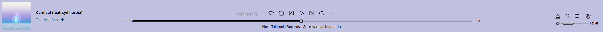
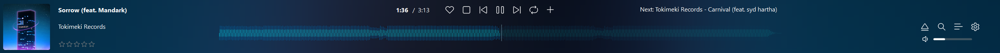
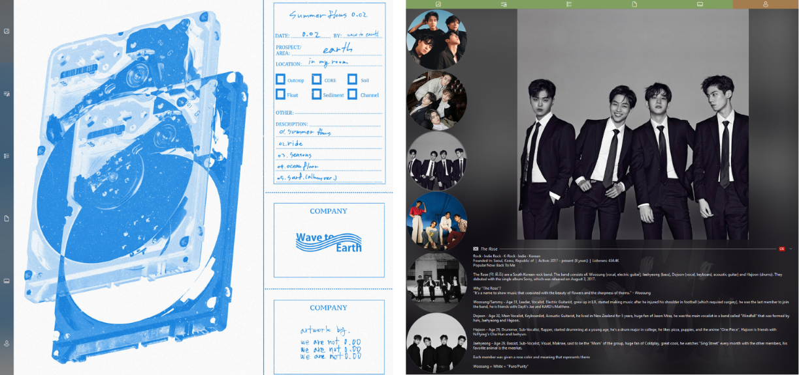
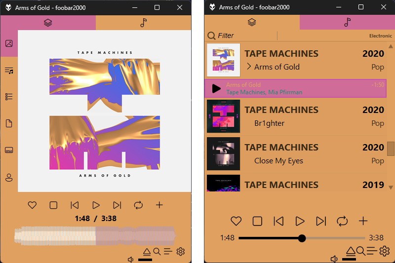

A crappy responsive [Spider Monkey Panel](https://github.com/TheQwertiest/foo_spider_monkey_panel) based 64-bit CUI foobar2000 theme.

# Preview
  
Responds to window size & seamlessly snaps to Windows 11 snap layouts.  
[Gallery](#gallery)

# Modularity
This repo aims to provide a basic customization guide for fb2k, some basic scripts & component suggestions for achieving this.

* All panel scripts can easily be used individually for other themes
* The main panel is the blueprint for the layout & controls panel placement within the main JSplitter
    * Can be used to easily make other themes responsive with some modding
    * Panels can be swapped out if the same title is kept or if the script is modified
* Panels within the tab script/panel are not hardcoded, they can be edited.

Refer to this [readme](https://github.com/Choya5011/Poobar/tree/main/profile/poobar-scripts/README.md) inside the poobar-scripts directory where the scripts are located for further info.

# Components & Packages
**Fonts**  
Standard already on Windows 11: [Segoe Fluent Icons](https://learn.microsoft.com/en-us/windows/apps/design/downloads/#fonts)  
Optional (For Biography): [Fontawesome](https://github.com/FortAwesome/Font-Awesome/blob/4.x/fonts/fontawesome-webfont.ttf)

**Components**  
Required: [Columns UI](https://www.foobar2000.org/components/view/foo_ui_columns) | [JSplitter](https://hydrogenaudio.org/index.php/topic,126743.msg1063721.html#msg1063721) (4.0.4) | [Playback Statistics](https://www.foobar2000.org/components/view/foo_playcount) | [OpenLyrics](https://www.foobar2000.org/components/view/foo_openlyrics) alternatively [ESLyric](https://github.com/ESLyric/release)  
Optional: [Waveform minibar (mod)](https://www.foobar2000.org/components/view/foo_wave_minibar_mod) | [Scrobble](https://www.foobar2000.org/components/view/foo_scrobble) | foo_lastfm_playcount_sync

**Packages**  
Required: [Biography](https://hydrogenaudio.org/index.php/topic,112914.msg1071222.html#msg1071222)  
Optional: [Library Tree](https://hydrogenaudio.org/index.php/topic,111060.msg1072806.html#msg1072806) | [Not-A-Waveform-Seekbar-SMP](https://github.com/regorxxx/Not-A-Waveform-Seekbar-SMP)

# Installation
**Fonts**  
Install fonts if not yet on system. Segoe Fluent Icons is already on Windows 11 by default. 

**NOTE**  
Trying a portable install first is recommended, setup hasn't been extensively tested yet after updating it.  
This note will be removed as soon as that's been done.

**Portable Instructions**  
1. Install Foobar as portable (clean install)
2. Download Poobar from the [main branch](https://github.com/Choya5011/Poobar/archive/refs/heads/main.zip)
3. Extract the 'profile' folder from the zip into Foobar's root folder.
2. Start Foobar & pick 'Columns UI' if prompted.

**Standard non-portable Instructions**
1. Install Foobar as a standard installation.
2. Download Poobar from the [main branch](https://github.com/Choya5011/Poobar/archive/refs/heads/main.zip)
3. Extract the contents of the 'profile' folder into Foobar's root folder. This is typically located at:
   - C:\Users\\[Username]\AppData\Roaming\foobar2000-v2
4. Start Foobar & pick 'Columns UI' if prompted.

**NOTES**  
After setup the theme is typically set to the ESLyric ```poobar_lib_naws.fcl``` preset. ```_lib``` presets typically consume more RAM, if 'as light as possible' is desired swap to a ```_fil``` preset. This can be done by importing another fcl layout:
Preferences -> Columns UI -> Main -> Import configuration -> poobar_fil_naws.  
There is a readme file inside the presets folder that gives info on RAM usage for the presets if this is of interest.

After setup the theme is also usually set to the Not-A-Waveform-Seekbar-SMP waveform seekbar (```_naws``` presets). If this is not desired:  
- To delete: Preferences -> Columns UI -> Layout -> Bottommost JSplitter -> Right-Click -> Remove Panel  
- To replace: Delete (previous instruct) -> JSplitter it was nested in -> Insert panel -> Panels -> Waveform minibar (mod)  

If deleted the Fluent Control Panel will show an error, simply switch the seekbar mode from waveform to normal.

**Useful To Know**  
Refer to this [readme](https://github.com/Choya5011/Poobar/tree/main/profile/poobar-scripts/README.md) inside the poobar-scripts directory.

# Gallery
**Fluent Control Panel**



**Tabs**



**Mini Player**  
If window gets small enough. Smallest state is Fluent Control Panel only.


---
Credits to the original authors of any modified scripts as well as packages. Names can be found in their respective scripts.
