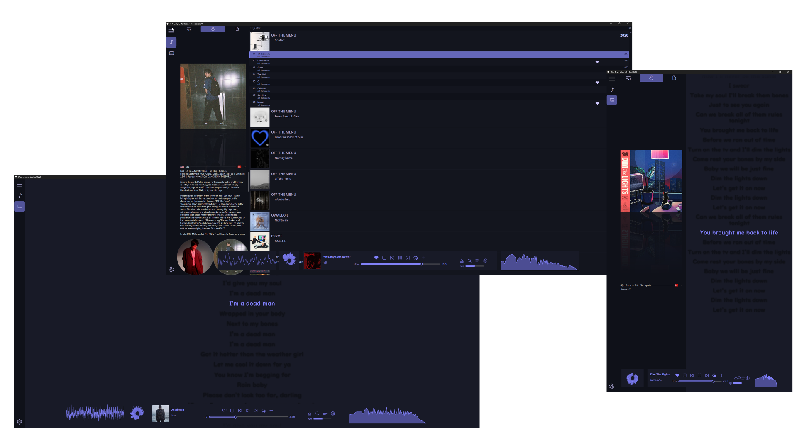

A crappy responsive [JSplitter](https://hydrogenaudio.org/index.php/topic,126743.0.html) based 64-bit CUI foobar2000 theme.

## Preview
**Split**  
  
**Multi**  

**Amethyst-like (WIP)**  

Responds to window size & seamlessly snaps to Windows 11 snap layouts.  
[Gallery](#gallery) | [Wiki Showcase](https://github.com/Choya5011/Poobar/wiki)

## Modularity
This repository provides a basic JSplitter/SMP customization guide for foobar2000, as well as a showcase of JSplitter’s capabilities. It includes some basic scripts and component recommendations to help achieve these customizations.

* All panel scripts can easily be used individually for other themes
* The main panel script is the blueprint for the layout & controls panel placement within the main JSplitter
    * Can be used to easily make other themes responsive with some modding
    * Panels can be swapped out if the same title is kept or if the script is modified
    * It currently comes with three pre-configured transforming layouts.
* Panels within the tab panel are not hardcoded, they can easily be edited.

Refer to the wiki's [script descriptions](https://github.com/Choya5011/Poobar/wiki/Poobar#script-descriptions) for further info

## Assets
### Fonts  
Standard already on Windows 11: [Segoe Fluent Icons](https://learn.microsoft.com/en-us/windows/apps/design/downloads/#fonts)  
Optional (For Biography): [Fontawesome](https://github.com/FortAwesome/Font-Awesome/blob/4.x/fonts/fontawesome-webfont.ttf)  
Optional (Lyrics): UD Digi Kyokasho (NP-B)

### Components & Packages (included)
**Components**  
[Columns UI](https://www.foobar2000.org/components/view/foo_ui_columns) | [JSplitter](https://hydrogenaudio.org/index.php/topic,126743.msg1063721.html#msg1063721) | [ESLyric](https://github.com/ESLyric/release) | [Playback Statistics](https://www.foobar2000.org/components/view/foo_playcount) | [Waveform minibar (mod)](https://www.foobar2000.org/components/view/foo_wave_minibar_mod) | [Oscilloscope Visualisation](https://www.foobar2000.org/components/view/foo_vis_oscilloscope) | [Spectrum Analyzer](https://www.foobar2000.org/components/view/foo_vis_spectrum_analyzer)

**Packages**  
[Not-A-Waveform-Seekbar-SMP](https://github.com/regorxxx/Not-A-Waveform-Seekbar-SMP) | [Biography](https://hydrogenaudio.org/index.php/topic,112914.msg1071222.html#msg1071222) | [Library Tree](https://github.com/regorxxx/Library-Tree-SMP)

## Installation
**Fonts**  
Install fonts if not yet on system. Segoe Fluent Icons is already on Windows 11 by default.
**Portable Instructions**  
1. Install [Foobar](https://www.foobar2000.org/windows) as portable.
2. Download Poobar from the [release page](https://github.com/Choya5011/Poobar/releases) or as nightly from the [main branch](https://github.com/Choya5011/Poobar/archive/refs/heads/main.zip)
3. Extract the 'profile' folder from the zip into Foobar's root folder.
2. Start Foobar & pick ```Columns UI``` if prompted.

**Standard non-portable Instructions**
1. Install Foobar as a standard installation.
2. Download Poobar as before.
3. Extract the contents of the 'profile' folder into Foobar's root folder. This is typically located at:
   - ```C:\Users\\[Username]\AppData\Roaming\foobar2000-v2```
4. Start Foobar & pick ```Columns UI``` if prompted.

**Notes**  
The theme comes with three main presets. After setup the theme is usually set to the ```split``` preset, to swap to another refer to this [wiki](https://github.com/Choya5011/Poobar/wiki/Swapping-Layouts) section.  

**Useful To Know**  
Refer to the [wiki](https://github.com/Choya5011/Poobar/wiki/Useful-to-know) for further info. Such as customization or for troubleshooting.

## Gallery
**Fluent Control Panel**  


[wiki](https://github.com/Choya5011/Poobar/wiki/Poobar#fluent-control-panel)

**Tabs**


[wiki](https://github.com/Choya5011/Poobar/wiki/Poobar#poobar-tabs)

**Mini Player**  
If window gets small enough. Smallest state is Fluent Control Panel only.


## Credits
Credits to the original authors of any modified scripts as well as any included packages & components.    
Original author names are present in modified scripts.

Themes in this repo are inspired by:
* Classic Poobar: [Eureka Theme](https://www.reddit.com/r/foobar2000/comments/1mhdyy5/comment/n6ve749/)
* Amethyst-like: [Amethyst](https://github.com/Geoxor/amethyst)
