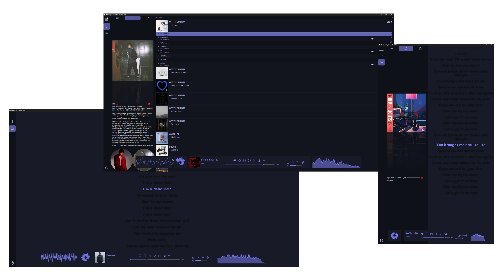

A crappy responsive [JSplitter](https://hydrogenaudio.org/index.php/topic,126743.0.html) based 64-bit CUI foobar2000 theme.

## Preview
**Split**  
  
**Multi**  

**Amethyst-like (WIP)**  

Responds to window size & seamlessly snaps to Windows 11 snap layouts.  
[Gallery](https://github.com/Choya5011/Poobar/wiki)

## Modularity
This repository provides a basic JSplitter customization guide for foobar2000, as well as a showcase of JSplitter’s splitter capabilities.  
It includes some basic scripts and component recommendations to help achieve these customizations.

* All panel scripts can easily be used individually for other themes.
* Panels within the tab panel are hot-swappable like a normal tabstack.
* The main panel script is the blueprint for the layout & controls panel placement within the main JSplitter.
    * Panels can be swapped out if instructions are followed.
    * Can be used to easily make other themes responsive with some modding.
    * Currently there are three pre-configured transforming layout  main panel scripts.

The themes main scripts are mostly JSplitter based and not SMP compatible.  
Refer to the wiki's [script descriptions](https://github.com/Choya5011/Poobar/wiki/Poobar#script-descriptions) for further info

## Assets
### Fonts  
Standard already on Windows 11 (required): [Segoe Fluent Icons](https://learn.microsoft.com/en-us/windows/apps/design/downloads/#fonts) | [download](https://aka.ms/SegoeFluentIcons)  
Used in Biography & Library Tree (required): [Fontawesome](https://github.com/FortAwesome/Font-Awesome/blob/4.x/fonts/fontawesome-webfont.ttf) | [download](https://github.com/FortAwesome/Font-Awesome/raw/4.x/fonts/fontawesome-webfont.ttf)  
Lyrics (optional): [UD Digi Kyokasho (NP-B)](https://learn.microsoft.com/en-us/typography/font-list/ud-digi-kyokasho)

### Components & Packages (included)
**Components**  
[Columns UI](https://www.foobar2000.org/components/view/foo_ui_columns) | [JSplitter](https://hydrogenaudio.org/index.php/topic,126743.msg1063721.html#msg1063721) | [ESLyric](https://github.com/ESLyric/release) | [Playback Statistics](https://www.foobar2000.org/components/view/foo_playcount) | [Waveform minibar (mod)](https://www.foobar2000.org/components/view/foo_wave_minibar_mod) | [Oscilloscope Visualisation](https://www.foobar2000.org/components/view/foo_vis_oscilloscope) | [Spectrum Analyzer](https://www.foobar2000.org/components/view/foo_vis_spectrum_analyzer)

**Packages**  
[Not-A-Waveform-Seekbar-SMP](https://github.com/regorxxx/Not-A-Waveform-Seekbar-SMP) | [Biography](https://hydrogenaudio.org/index.php/topic,112914.9999999.html#bot) | [Library Tree](https://github.com/regorxxx/Library-Tree-SMP)

**Frameworks**  
[Menu-Framework-SMP](https://github.com/regorxxx/Menu-Framework-SMP)

## Installation
**Fonts**  
Install fonts if not yet on system. Segoe Fluent Icons is already on Windows 11 by default.  

**Portable Instructions**  
1. Install [Foobar](https://www.foobar2000.org/windows) as portable.
2. Download Poobar from the [release page](https://github.com/Choya5011/Poobar/releases) or as nightly from the [main branch](https://github.com/Choya5011/Poobar/archive/refs/heads/main.zip)
3. Extract the 'profile' folder from the zip into Foobar's root folder.
2. Start Foobar & pick ```Columns UI``` if prompted.

**Standard non-portable Instructions**
1. Install Foobar as a standard installation.
2. Download Poobar as before.
3. Extract the contents of the 'profile' folder into Foobar's root folder. This is typically located at:
   - ```C:\Users\[Username]\AppData\Roaming\foobar2000-v2```
4. Start Foobar & pick ```Columns UI``` if prompted.

**Notes**  
The theme comes with three main presets and their stripped lite counterparts. To swap to layouts refer to this [wiki](https://github.com/Choya5011/Poobar/wiki/Swapping-Layouts) section.  

**Useful To Know**  
Refer to the [wiki](https://github.com/Choya5011/Poobar/wiki/Useful-to-know) for further info. Such as customization or for troubleshooting.

## Credits
Credits to the original authors of any modified scripts as well as any included packages & components.    
Original author names are present in modified scripts & most item links are present in this readme at [Assets](#assets).

Themes in this repo are inspired by:
* Classic Poobar: [Eureka Theme](https://www.reddit.com/r/foobar2000/comments/1mhdyy5/display_the_next_track_and_add_tracks_to_queue_in/)
* Amethyst-like: [Amethyst](https://github.com/Geoxor/amethyst)
