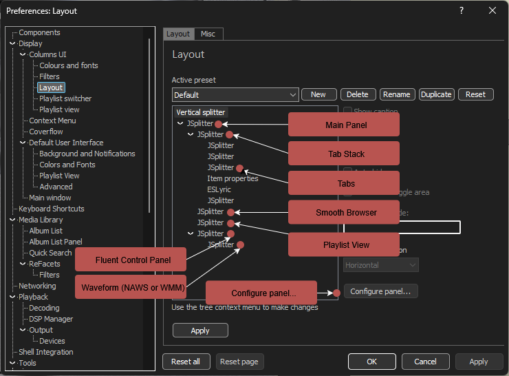

# Contents
1. [Useful to know](#useful-to-know)  
2. [Script Descriptions](#script-descriptions)  
3. [Theme Structure](#theme-structure)  
4. [Basic JSplitter Guide](#basic-jsplitter-guide)

## Useful to know
**Customizing:**
* [Right-click](#basic-jsplitter-guide) panels to see the context menu options for that panel. If panel has searchbar or scrollbar preferably right click there to get correct menu.
* Component recomendations for customizing the title bar: [UI-Wizard](https://github.com/The-Wizardium/UI-Wizard/) | [foo_openhacks](https://github.com/ttsping/foo_openhacks) | UI Hacks (32-bit)

**Stats tracking:**
* Playcount toggle in PL view: foo_playcount or lastfm_playcount. Both components store their own local DB.
* When using the like/heart buttons make sure both the control panel (seekbar section) and the PL are set to the same mode.
* personal rec: The foo_lastfm_playcount_sync component includes the option of syncing likes to last.fm.
* personal rec: [foo_scrobble](https://www.foobar2000.org/components/view/foo_scrobble) is a component that syncs playcount/scrobbles to last.fm.

**Lyric Components:**
* OpenLyrics: more plug & play, included in fcl presets
* ESLyric: extremely customizable, not included in fcl presets
* The font used for Lyrics in this theme is "UD Digi Kyokasho NP-R". To change font:
  * OpenLyrics: Preferences -> Tools -> OpenLyrics -> Display -> check Custom font -> select font
  * ESLyric: Richt Click -> Panel Options... -> Font & Color

**Queue button instructions:**
* left click: add
* right click: remove
* middle click: clear
* select multiple tracks -> double click then right click (reason for combo: bugged/incomplete): adds tracks randomly

**Troubleshooting:**
1. If there is a pop-up about the rating each time the Fluent Control Panel script is loaded: right click the rating stars & set mode to foo_playcount or another mode of choice. This will eliminate the popup.
2. If monitor resolution is changed while foobar is open restart to refresh.
3. If ever locked out of access to preferences button: ctrl + p

## Script Descriptions
Most visual scripts support system, dynamic & custom colors. Dynamic album art background & custom image background.  
See [complete](https://github.com/Choya5011/Poobar/tree/main/profile/poobar-scripts/poobar/complete) directory for scripts.

### Fluent Control Panel  
A control panel that uses the Segoe Fluent Icons font for its icons & the panel this theme is centered around.  
Modified from the original Fluent Control Panel by eurekagliese.  
Adjusts item placement based on panel size.  
Clicking the album art will perform a media library search on the artist. The rest is self-explanatory.

### Poobar Main Panel
All panels are placed inside one main JSplitter with the MP script as panel placement script.

Relies on (custom) panel title to place panels. These are accessible inside the CUI layout editor.  
The main panel currently has 4 panels it looks out for titled:
* 'Fluent Control Panel'
* '' (Playlist View: Segoe Fluent Icons MusicNote, unicode: ec4f)
* '' (Tab Stack: Segoe Fluent Icons MapLayers, unicode: e81e)
* 'Smooth Browser'

If the title of any of these are changed & the MP script isn't adjusted for it the MP can not fetch the panel.

**Customization:**
* The script contains 5 elif blocks for 5 different window states, what's set in these blocks determines panel placement per window state.
* For basic layout adjustment such as adjusting control panel height the main panels properties need to be accessed:
    * Preferences -> Display -> Columns UI -> Layout -> select topmost JSplitter -> Configure panel... -> Properties
    * This provides 4 basic adjustments, deeper layout adjustment requires editing the script.

### poobar tabs
A tab script that scales with tab panel size & adjusts tabs to take all horizontal/vertical space.

### poobar tabs pt
A slightly modified version of 'poobar tabs' meant for the ESLyric presets.  
Behaves slightly different in terms of visuals & uses pseudo transparency.  
Use 'poobar tabs' for custom themes unless this ones features are desired.

## Theme Structure
- Base is a Vertical splitter cause setting the base as a JSplitter makes the JSplitter buggy by having inaccessible panel configuration.
- Tab Stack contains some pre-configured items. These can be swapped out or removed to taste.
- Smooth Browser is used as space filler for certain window sizes.
- The waveform inside Fluent Control Panel can be swapped out for any waveform panel of choice. As long as it is always the only (or topmost) item inside Fluent Control Panel it will be placed accordingly.

## Basic JSplitter Guide
To configure a JSplitter panel right click it and select 'Panel Properties' or 'Configure panel...'  
'Configure panel...' can also be accessed inside the [CUI Layout](#theme-structure) editor, click the desired JSplitter inside the editor and select 'Configure panel...'

Either of these will open the JSplitter configuration:

What can be done with this window:
- Scripts can be set: a complete sample, custom file or stored in-memory.
- Packages can be set or update. To update or install a new package select the 'import' option inside the Package manager and select the downloaded package zip file.
- A scripts Properties (settings) can be edited in the Properties tab, a lot of these settings are usually already accessible from the context menu when right-clicking a JSplitter panel. This depends on the script however, usually there are some hidden settings here.
